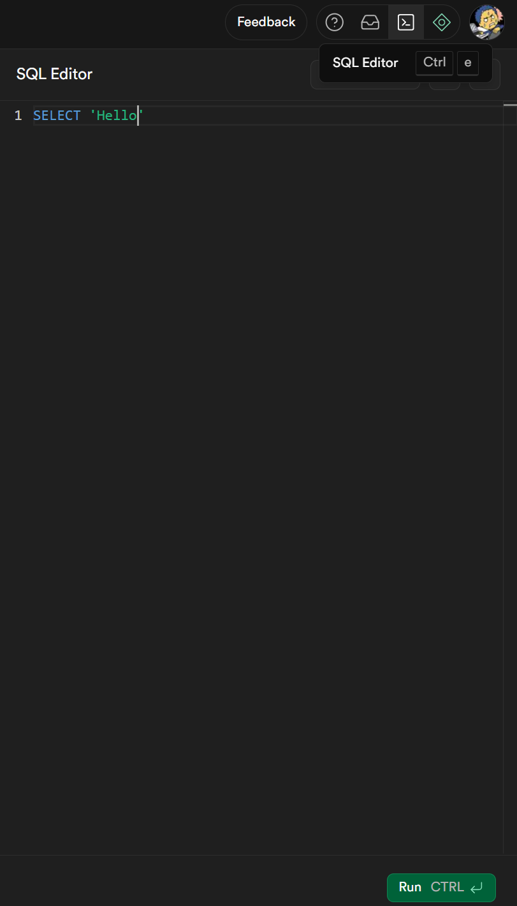
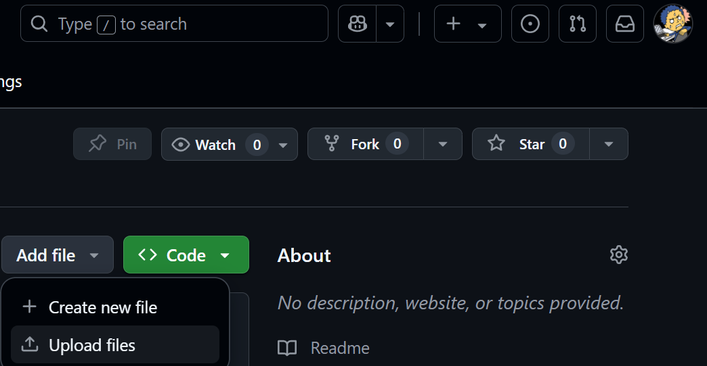

# Lab Instructions

Based on your diagram, create and complete your own copy of the template SQL file.

This completed file will create the database to your design specifications.

To execute the creation of your database, use your command prompt and replace the <keywords> with the neccessary changes for your Supabase DB.

```bash
psql -d "postgres://<user>:<password>@<hostname>" -f loadDatabase.sql
```

To find your values, refer to 

    For user, password, and hostname
    Project Settings > Connect (at the top)


    Procject Settings > Data API (in the side bar)

The simpler approach, is to complete your SQL file and run it in the Supabase SQL Editor.


# Deliverables

Upload a screenshot of your DB either in Supabase or pgAdmin into your Github Repo and Submit your repo link on Schoology.

